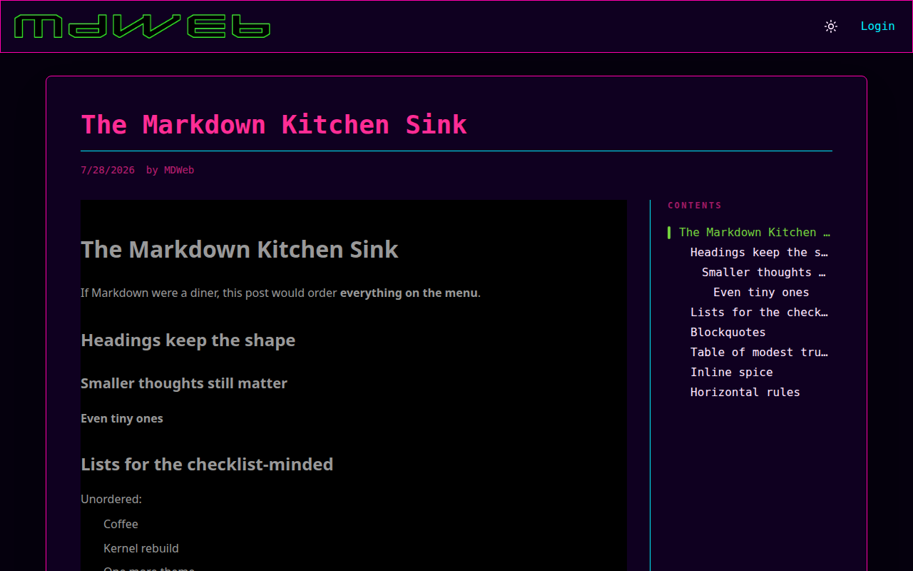
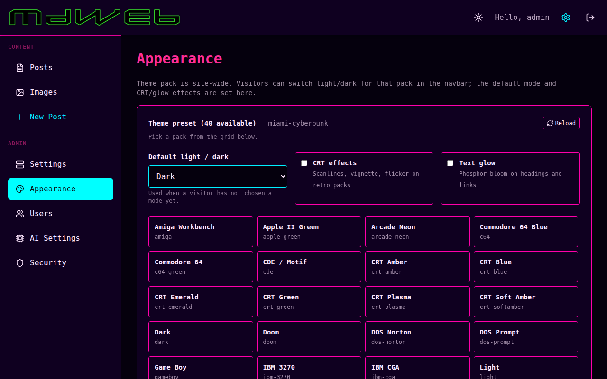

# MDWeb

**A personal website and blog that stores everything as files.**  
Markdown for posts. JSON for settings and themes. **No database.**

You write. You own the files. You run it on your machine — FreeBSD preferred, Node anywhere.

---

## Why this exists

Most “simple” blogs still want Postgres, a cloud account, or a proprietary export. MDWeb does not.

- **Posts are `.md` files** — edit in vim, VS Code, or the built-in admin editor  
- **Config and users are JSON** — readable, greppable, backup with `tar` or ZFS  
- **Themes are JSON color packs** — dozens of skins (CRT, Miami, Win95, Matrix, …), each with light and dark  
- **No MySQL, Postgres, SQLite, or Redis required** for day-to-day operation  

If you can copy a folder, you can move your site.

---

## Screenshots


| A Markdown post | Theme picker (admin) |
|-----------------|----------------------|
|  |  |

Every shipped theme in light and dark: **[docs/THEMES.md](docs/THEMES.md)**

| Miami Cyberpunk | Matrix | CRT Amber |
|-----------------|--------|-----------|
|  |  |  |

---

## What you need

| Install path | Requirements |
|--------------|----------------|
| **FreeBSD package / port** | FreeBSD host, Node (pulled in by the port), a strong secret for login tokens |
| **From source** | Node.js 18+, npm |

That is it. No separate database server to install or tune.

---

## Install on FreeBSD (recommended)

1. Install the `www/mdweb` package or build the port under `ports/www/mdweb/`.  
2. Create a strong secret (required in production):

   ```sh
   printf 'JWT_SECRET=%s\n' "$(openssl rand -hex 32)" | sudo tee /usr/local/etc/mdweb.env
   sudo chmod 0600 /usr/local/etc/mdweb.env
   ```

3. Enable and start the service:

   ```sh
   sudo sysrc mdweb_enable=YES
   sudo service mdweb start
   ```

4. Open the site in a browser: `http://YOUR-HOST:5173`  
   (Use your machine’s hostname or IP — whatever you use for other services on that box.)

5. Log in with the default admin account and **change the password immediately**:

   - User: `admin`  
   - Password: `admin`  

   ```sh
   # from a checkout, or use the admin UI once logged in
   npm run change-password -- admin 'your-strong-password'
   ```

### Where your data lives (package install)

| Path | What |
|------|------|
| `/usr/local/etc/mdweb/config.json` | Site name, theme, appearance, security options |
| `/usr/local/etc/mdweb/users.json` | Accounts (password hashes) |
| `/var/db/mdweb/posts/` | **Your Markdown posts and images** |
| `/var/db/mdweb/themes/` | Theme files (including any color tweaks you save) |

Upgrades replace the app under `/usr/local/www/mdweb`. They do **not** wipe posts or config when installed correctly. Details: [docs/UPGRADE.md](docs/UPGRADE.md).

---

## Install from source (any OS with Node)

```bash
git clone <this-repo>
cd mdweb   # or freebsdguy, depending on your checkout
npm install
npm run dev
```

Open **http://localhost:5173**, log in as `admin` / `admin`, change the password.

Production-style run:

```bash
export JWT_SECRET="$(openssl rand -hex 32)"
npm run build
npm start
```

Posts in development are ordinary Markdown files under `server/posts/`.

---

## Day-to-day use

| Task | How |
|------|-----|
| Write a post | Log in → Admin → New Post, or drop a `.md` file into the posts directory |
| Change site look | Admin → **Appearance** → pick a theme → Set as site theme |
| Light / dark | Anyone: sun/moon control in the navbar (applies to the current theme pack) |
| Users | Admin → Users (admin only) |
| Auth style | Admin → **Security** — JWT (default) or classical session cookies; see [docs/AUTH.md](docs/AUTH.md) |

Showcase posts (math, code, Mermaid, kitchen-sink Markdown) can appear on first install; they are only copied if those files are not already present, so your writing is never overwritten. Markdown notes: [docs/MARKDOWN.md](docs/MARKDOWN.md).

---

## Documentation

| Doc | Audience |
|-----|----------|
| [docs/ADMIN.md](docs/ADMIN.md) | Running the admin UI |
| [docs/AUTH.md](docs/AUTH.md) | JWT vs session login |
| [docs/UPGRADE.md](docs/UPGRADE.md) | Backups, upgrades, durable paths |
| [docs/MARKDOWN.md](docs/MARKDOWN.md) | What works in posts |
| [docs/THEMES.md](docs/THEMES.md) | Full theme gallery |
| [docs/DEVELOPMENT.md](docs/DEVELOPMENT.md) | Building from source, tests, contributing |

---

## License

**MIT License**  
Copyright (c) 2026 Mark LaPointe  

Free to use, modify, and distribute, subject to the terms in [LICENSE](./LICENSE). Provided as-is, without warranty.
