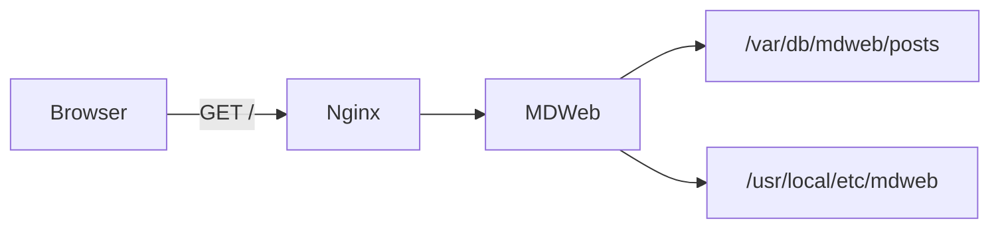
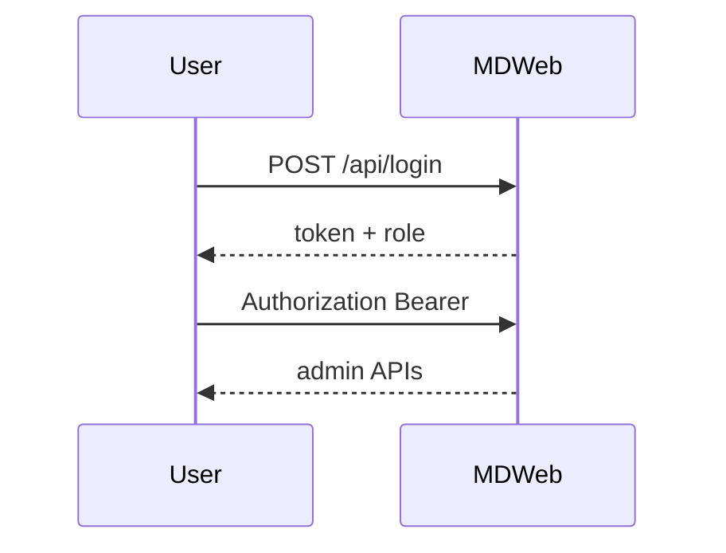

# Diagrams Over Coffee

Whiteboards are great until someone erases the good box. Keep the diagram next to the prose.

## Request path

## Login sequence (JWT mode)

Sip coffee. Ship the doc. Skip the proprietary whiteboard export.
